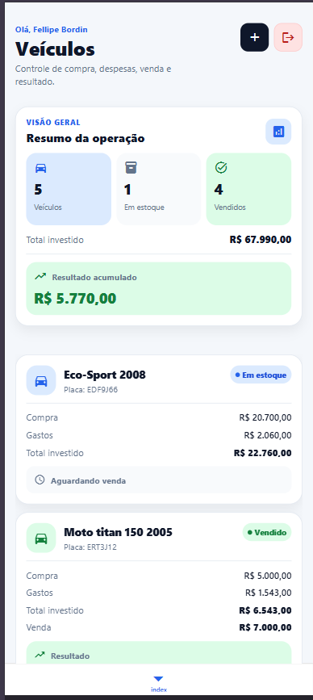
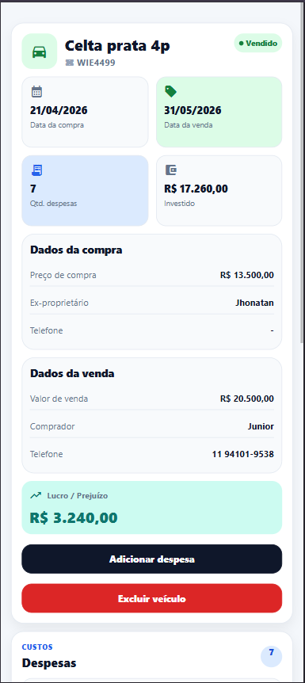
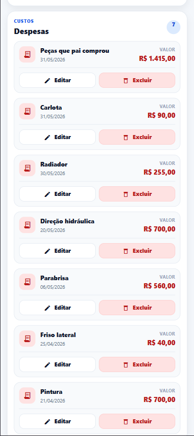
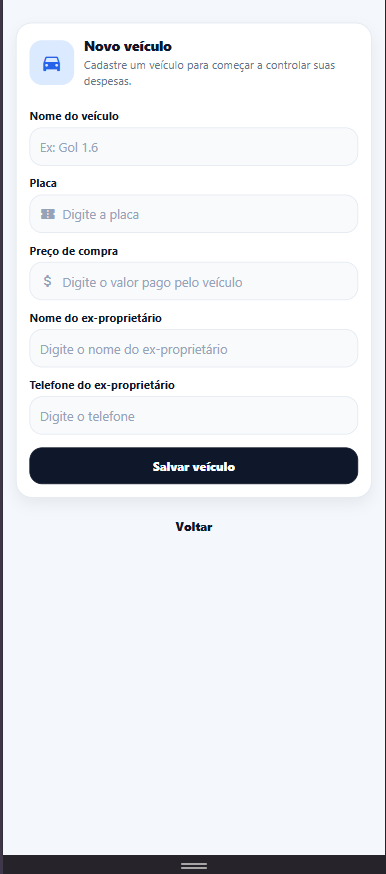

# 🚗 Vehicle Control

Aplicativo mobile desenvolvido com **React Native + Expo** para gerenciamento completo de compra, despesas e venda de veículos.

O projeto foi desenvolvido para auxiliar pequenos lojistas e revendedores a controlar todo o ciclo de negociação dos veículos, desde a compra até a venda, calculando automaticamente investimentos, despesas e lucro de cada operação.

---

## 📱 Demonstração

> Adicione aqui um GIF ou vídeo do aplicativo.

### Telas

- Login
- Cadastro
- Recuperação de senha
- Dashboard
- Lista de veículos
- Detalhes do veículo
- Cadastro de despesas
- Venda de veículo
- Configurações (Tema)

---

## ✨ Funcionalidades

### 🔐 Autenticação

- ✅ Cadastro de usuários
- ✅ Login com autenticação JWT
- ✅ Recuperação de senha
- ✅ Sessão persistente
- ✅ Logout

---

### 🚗 Gerenciamento de veículos

- ✅ Cadastro de veículos
- ✅ Edição de veículos
- ✅ Exclusão de veículos
- ✅ Marcar veículo como vendido

---

### 💰 Controle financeiro

- ✅ Cadastro de despesas
- ✅ Edição de despesas
- ✅ Exclusão de despesas
- ✅ Cálculo automático do investimento total
- ✅ Cálculo automático de lucro ou prejuízo
- ✅ Dashboard financeiro

---

### 🎨 Interface

- ✅ Tema Claro
- ✅ Tema Escuro
- ✅ Tema Sistema (segue o dispositivo)
- ✅ Preferência de tema salva automaticamente
- ✅ Componentes reutilizáveis
- ✅ Design responsivo
- ✅ Estados de Loading
- ✅ Empty State
- ✅ Error State

---

## 🛠 Tecnologias

### Mobile

- React Native
- Expo SDK 54
- Expo Router
- TypeScript

### Backend

- Next.js
- Node.js
- Prisma ORM
- PostgreSQL (Neon)

### Autenticação

- JWT

### Armazenamento

- AsyncStorage

### Estilização

- StyleSheet
- Context API
- Theme Provider

---

## 📂 Estrutura do projeto

```text
src
│
├── components
│   ├── common
│   ├── vehicle
│   └── settings
│
├── contexts
│
├── hooks
│
├── lib
│
├── services
│
├── styles
│
├── types
│
└── utils
```

---

## 🎯 Arquitetura

O projeto foi organizado seguindo princípios de componentização e separação de responsabilidades.

- Componentes reutilizáveis
- Hooks personalizados
- Context API
- Helpers
- Services
- Tipagem com TypeScript
- Design System
- Tema dinâmico

---

## 📸 Screenshots

### Home Page



### Detalhe de Veiculo



### Despesas do Veiculo



### Adicionar Despesas


### Adicionar novo Veiculo



---

## 🚀 Como executar

```bash
git clone https://github.com/FellipeBordin/mobile-veicles.git
```

```bash
cd mobile-expo
```

```bash
npm install
```

```bash
npx expo start
```

---

## 📌 Próximas melhorias

- [ ] Perfil do usuário
- [ ] Filtros de veículos
- [ ] Pesquisa por placa
- [ ] Exportação de relatórios
- [ ] Upload de imagens dos veículos

---

## 👨‍💻 Desenvolvido por

**Fellipe Bordin**

- GitHub: https://github.com/FellipeBordin
- LinkedIn: _(adicione seu perfil aqui)_
